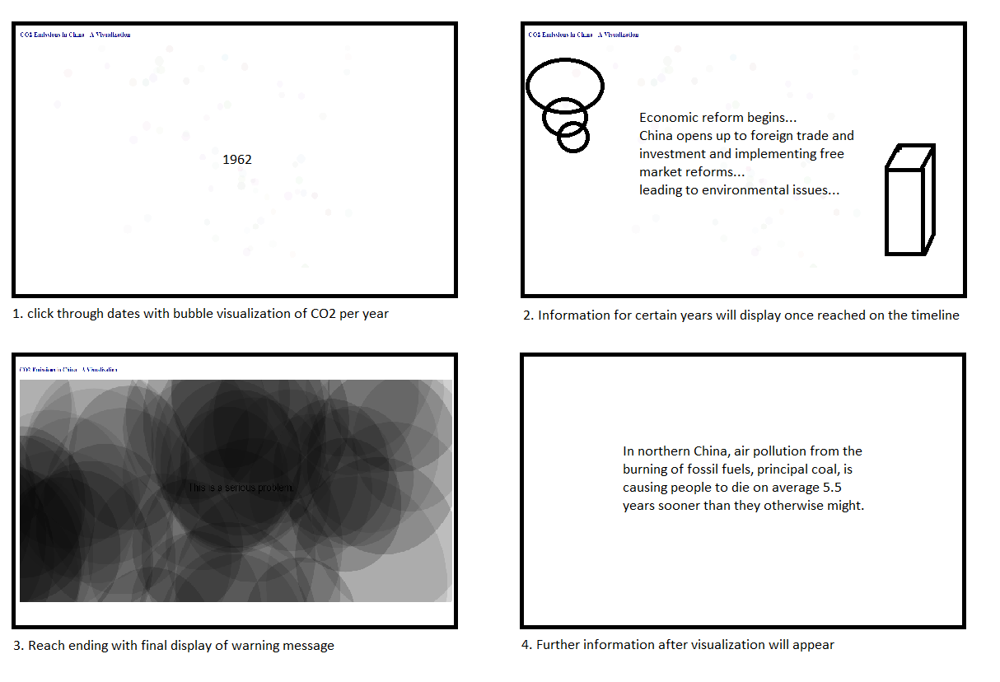

# Final Project- Interactive Graphics and Critical Code

Name: Ian Hua

Date: 4/18/18

## Project: Pollution in China - A Visualization

### Conceptual Description

This project is a thorough visualization to highlight the significance of a global issue. Pollution in China, as well as the world, is at an all time high, and this piece aims to capture the catastrophic increase of pollution. In northern China, air pollution from the burning of fossil fuels, principal coal, is causing people to die on average 5.5 years sooner than they otherwise might. Lung cancer is a widespread thing and only seems to get worse. 

### Interaction Description

Simply click through the piece.

### Extension 

I plan on extending the Visualization project from earlier this semester. I plan on adding various elements, including background images, important events throughout the timeline, possibly links after the viewer is finished with the piece, etc. These extensions will provide the viewer a greater feel of the issue at hand and potentially motivate the viewer to immediately help.

### Drawing or Sketch of Extended Piece



### Technical Details

Using p5.js, hosted on GitHub Pages

Snippets:
```js
// increases the year displayed each mouse click, until the last year which displays a warning...
function mousePressed() {
    clicks = clicks + 1;
    if (clicks < years.length){
        middletext = years[clicks];
        for (var i = 0; i < n; i++){
            var ratio = co2[clicks]/co2[co2.length-1];
            mols[i].sizee = random(0.75,1.25)*ratio*500;
            mols[i].col = color((1-ratio)*random(200,255), (1-ratio)*random(200,255), (1-ratio)*random(200,255), random(20,50));
        }
    } else {
        middletext = "This is a serious problem."
    }
}
```

Link to your project's full code in this repository: WIP
